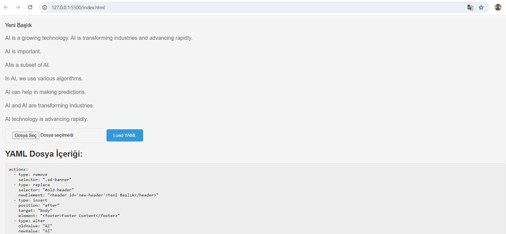

Vision Bridge Software Developer Assignment: Dynamic Webpage Modification
Overview

This JavaScript application dynamically modifies a webpage based on configurations provided in YAML files. It supports actions like removing, replacing, inserting, and altering DOM elements, while handling multiple YAML files and potential conflicts.

Core Functionality

YAML Configuration Parsing: Reads and parses YAML configuration files, supporting multiple files.
Action Types: Implements 'remove', 'replace', 'insert', and 'alter' actions based on YAML definitions.
Multiple Configuration Handling: Applies all configurations with a defined priority logic.
DOM Manipulation: Modifies the DOM according to the parsed actions.
Usage

Create YAML configuration files: Structure your YAML files according to the provided example.
Include the JavaScript code: Integrate the provided JavaScript code into your HTML page.
Call the loadYAML() function: Trigger the configuration loading process.
Example YAML:

YAML
actions:
  - type: remove
    selector: ".ad-banner"
  - type: replace
    selector: "#old-header"
    newElement: "<header id='new-header'>New Header</header>"
  - type: insert
    position: "after"
    target: "body"
    element: "<footer>Footer Content</footer>"
  - type: alter
    oldValue: "Machine Learning"
    newValue: "AI"

Limitations

Currently, the application does not support manipulating DOM attributes.
Future Enhancements

Implement support for attribute manipulation.
Introduce error handling for invalid YAML configurations.
Expand action types to include more complex DOM modifications.
Note:

Ensure you have a YAML parsing library (e.g., js-yaml) included in your project.
The application assumes a basic HTML structure and might require adjustments for specific use cases.
By following these steps and considering the provided information, you can effectively utilize this application to dynamically modify webpages based on your YAML configurations.

Before and After
Image 1: Demonstrates the initial state of the webpage before applying any YAML configurations.

Image 2: Showcases the transformed webpage after applying the YAML configuration file, highlighting the changes made based on the defined actions.

These images clearly illustrate the impact of the YAML configuration on the webpage's structure and content.

